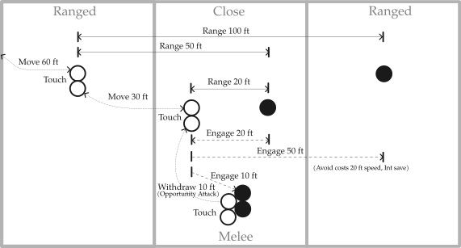

# Sly's Rules for Zoned Combat

For Dungeons & Dragons, 5th edition.

## Introduction

Zoned combat sits between gridded combat and pure theatre of the mind. It keeps meaningful range, movement, engagement, and area effects, but replaces exact positioning with abstract zones.

Ranges are simplified to Touch, 25 ft, 50 ft, and 100 ft. Similar ranges are treated the same: a heavy crossbow and longbow both fall into the 100 ft category, while a 10 ft reach weapon is treated the same as other melee weapons at Touch range.

Movement is also abstract. Changing range, engaging an enemy, or withdrawing from melee normally costs one standard move. A typical creature gets one standard move, while faster creatures may get additional moves.

The close range zone represents the current focus of the fight rather than a fixed area. As characters reposition, that focus can shift. Melee takes place within close range, with creatures in the same melee treated as able to reach one another.

This abstraction sacrifices some tactical precision. Exact adjacency, reach positioning, and carefully placing an area effect to catch particular enemies while avoiding nearby allies are generally not tracked.

In return, combat is faster and easier to run while still answering the common theatre-of-the-mind questions: "How far away are they?", "Where am I relative to the fight?", and "Can I reach them and attack?"

_Figure: Ultimate Dungeon Terrain_

Printable sheet: [Zoned Combat - Ultimate Dungeon Terrain](dnd-zones-udt.pdf)

## Zones

Combat uses four abstract positions:

- **Out of combat**, outside the active fight.
- **Long range**, far from the current action, with a separate long-range area for each side.
- **Close range**, near the current focus of the fight.
- **Melee**, engaged in close combat, within the close range zone.

The close range zone is not a fixed area. It represents the current focus of the fight and shifts as characters reposition. Moving towards a distant enemy may therefore bring that enemy into close range rather than moving your character into their long-range zone.

All melee takes place within close range. Usually there is one melee, with everyone in it treated as within Touch range of everyone else. Separate melees can be used when the fiction clearly calls for them.

Melee represents a shifting area of combat, not creatures standing still 5 ft apart. Combatants are assumed to be moving, circling, and closing within an area roughly 20 ft across. Entering that area — for example to touch an ally or use a very short-range spell — means entering the melee.

Out of combat does not necessarily mean too far away. A creature may instead be around a corner, behind sufficient cover, or otherwise unable to take part in the current fight.

### Encounter distance

Use the encounter distance tables on p. 38 of the _Dungeon Master's Guide_.

- Up to 50 ft: both groups start at close range.
- 55–100 ft: one group starts at close range and the other at long range.
- More than 100 ft: both groups start at long range.

Adjust for the situation. When approaching an encampment, for example, the guards might be at close range while the party and other enemies are at long range. A scout may already be at close range, perhaps hidden.

Indoor encounters usually begin with both groups at close range unless the space is unusually large. Moving to long range may mean falling back into an adjoining room while remaining in the fight.

### Using miniatures

Miniatures can be used to show the abstract positions, using something like Ultimate Dungeon Terrain.

Use three main areas: friendly long range, shared close range, and enemy long range. Put bases together within close range to show melee. Place out-of-combat creatures to the side.

### Using terrain

Terrain can be handled through theatre of the mind by giving each zone relevant features.

For example, stacked crates in the enemy long-range zone might provide cover, while exposed lava veins in close range could be used as a hazard for pushing creatures into.

## Range

Weapons, spells, and other effects use four abstract ranges: **Touch, 25 ft, 50 ft, and 100 ft**.

| Your zone   | Long range (friendly) | Close range (friendly) | Melee | Close range (enemy) | Long range (enemy) |
| ----------- | --------------------- | ---------------------- | ----- | ------------------- | ------------------ |
| Long range  | Touch                 | 50 ft                  | 50 ft | 50 ft               | 100 ft             |
| Close range | 50 ft                 | Touch                  | 25 ft | 25 ft               | 50 ft              |
| Melee       | 50 ft                 | 25 ft                  | Touch | 25 ft               | 50 ft              |

**Touch** means readily reachable. An unengaged ally in the same zone is within Touch range. To touch an enemy, or someone already in melee, you must enter that melee.

**25 ft** means nearby, but not readily reachable. This includes enemies in close range and creatures in melee when you are outside it. Examples include _poison spray_, normal range for a javelin, and long range for a dagger.

**50 ft** covers effects such as _ray of frost_ and _chromatic orb_, normal range for a shortbow, and long range for a spear.

**100 ft** covers effects such as _fire bolt_, normal range for a longbow, and long range for a shortbow.

Any creature in a melee may attack any other creature in the same melee. Reach and exact positioning within melee are not tracked.

## Movement

A standard move represents about 30 ft of movement. You normally get one standard move per turn; Dash gives you another.

| Movement                           | Cost             | Notes                                          |
| ---------------------------------- | ---------------- | ---------------------------------------------- |
| Out of combat to long range        | 2 standard moves | or vice versa                                  |
| Between long range and close range | 1 standard move  | or vice versa                                  |
| Move the focus                     | 1 standard move  | shifts an enemy from long range to close range |
| Engage an enemy in close range     | 1 standard move  | moves both of you into melee                   |
| Join an existing melee             | 1 standard move  | possible with only 1/2 a standard move         |
| Withdraw from melee to close range | 1 standard move  | may trigger an opportunity attack              |

To engage an enemy at long range, first move the focus to bring them into close range, then engage them.

For example, engaging an enemy at long range from out of combat takes 5 standard moves: 2 to reach long range, 1 to reach close range, 1 to charge the enemy (shifting the focus and bringing them into close range), and 1 to engage.

To engage a different enemy while already in melee, first withdraw (provoking opportunity attacks as normal), then engage the new target: 2 standard moves.

Fleeing from melee takes 4 standard moves: 1 to withdraw, 1 to reach long range, and 2 to leave combat.

### Speed

Standard moves are based on your available speed, rounded to the nearest 30 ft.

| Speed    | Standard moves    |
| -------- | ----------------- |
| 0 ft     | none              |
| 5–15 ft  | 1/2 standard move |
| 20–45 ft | 1 standard move   |
| 50–75 ft | 2 standard moves  |
| 80+ ft   | 3 standard moves  |

This also applies when only part of your movement remains. For example, after standing from prone, a creature with 30 ft speed has 15 ft left (1/2 a standard move).

Dashing doubles your standard moves. Creatures with reduced speed may need to Dash to change zones.

### Opportunity attacks

When you withdraw from melee, the number of opportunity attacks depends on how badly your side is outnumbered.

| Enemies compared to friendlies | Opportunity attacks |
| ------------------------------ | ------------------- |
| Same number or fewer           | 1                   |
| Up to twice as many            | 2                   |
| Up to three times as many      | 3                   |
| And so on                      | +1 per multiple     |

For example, 3 friendlies against 4 enemies gives 2 opportunity attacks; against 7 enemies, 3.

Each creature can still make only one opportunity attack per round, and Disengage prevents them as normal.

### Forced movement

Forced movement can move a creature out of melee as normal.

It can also shift the melee instead: rather than removing the target, treat the movement as pushing it away from an ally, allowing that ally to leave the melee.

If several enemies are involved, use the same ratio as opportunity attacks to determine how many must be moved. For example, with 3 friendlies and 4 enemies, moving 2 enemies is enough to free one ally.

## Area effects

Area effects normally affect a single zone: long range, close range, or melee. Effects **40 ft across or more** can affect both close range and melee; for circular effects, use diameter rather than radius.

Long lines can cross multiple zones. For example, _lightning bolt_ might affect 1 creature in melee, 2 in close range, and 1 at long range, rather than 4 creatures in the same melee.

The following values are based on the _Dungeon Master's Guide_ guidelines for **Adjudicating Areas of Effect** (p. 83), reorganised here by effect size for easier lookup.

| Size  | Cone | Cube | Radius |
| ----- | ---- | ---- | ------ |
| 5 ft  | 1    | 1    | 1      |
| 10 ft | 1    | 1    | 3      |
| 15 ft | 2    | 2    | 6      |
| 20 ft | 2    | 4    | 10     |
| 25 ft | 3    | 6    | 16     |
| 30 ft | 5    | 8    | 20     |
| 45 ft | 9    | 16   |        |
| 60 ft | 16   | 20   |        |

For lines, use length and width:

| Length | 5 ft wide | 10 ft wide |
| ------ | --------- | ---------- |
| 30 ft  | 2         | 3          |
| 60 ft  | 3         | 5          |
| 90 ft  | 4         | 8          |
| 120 ft | 5         | 10         |

Treat these as typical maximums. Adjust for how tightly creatures are grouped, their size, cover, and similar factors; adding or subtracting 1d3 targets is usually enough.

### Area effects into melee

For each enemy beyond the first affected in melee, one friendly in that melee is also affected. The GM may adjust this if one side greatly outnumbers the other.

For example, a _fireball_ could affect 2 enemies in close range and 3 enemies in melee, but would also catch 2 friendlies in that melee.

Effects that select targets or exclude creatures work normally.

## Variant: Extended-range combat

For battles in open terrain, you can double the normal zone ranges, allowing encounters to begin at 200 ft or more.

| Your zone   | Long range (friendly) | Close range (friendly) | Melee  | Close range (enemy) | Long range (enemy) |
| ----------- | --------------------- | ---------------------- | ------ | ------------------- | ------------------ |
| Long range  | Touch                 | 100 ft                 | 100 ft | 100 ft              | 200 ft             |
| Close range | 100 ft                | Touch                  | 50 ft  | 50 ft               | 100 ft             |
| Melee       | 100 ft                | 50 ft                  | Touch  | 50 ft               | 100 ft             |

Movement costs are doubled accordingly:

| Movement                           | Cost                                     |
| ---------------------------------- | ---------------------------------------- |
| Out of combat to long range        | 2 standard moves or more, as appropriate |
| Between long range and close range | 2 standard moves                         |
| Move the focus                     | 2 standard moves                         |
| Engage an enemy in close range     | 2 standard moves                         |
| Join an existing melee             | 1 standard move                          |
| Withdraw from melee to close range | 2 standard moves                         |

Extended-range combat gives long-range weapons and high movement speeds more room to matter, and allows battles that would require impractical amounts of space on a grid.
